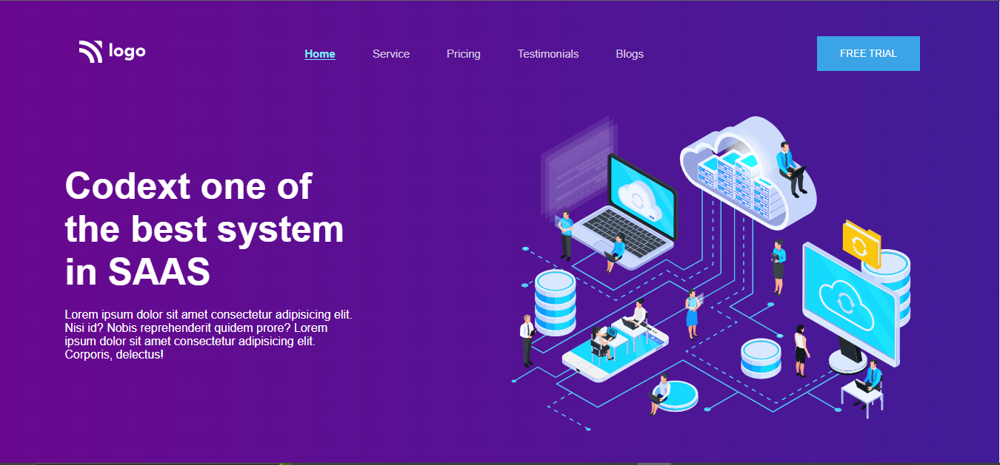

# Project 13: SAAS landing page using HTML  and CSS 

Chandrakala P

## Final Look of the Webpage:

### Live project Link:

[project link](https://bussiness-landing-page-project12.netlify.app/)

## What I learnt from this Project?

- This project helped me to understand the whole idea of Html and css.
- I learnt most of the basics tags in html and many properties in css.
- It helped me to understand more about css selectors, varibales etc.
- This project helped me to understand background-img and bgc, buttons, box-shadow text-transform, text-decoration and many more properties in css and also positioning and transform property in css and many more.

## Stacks and Tools:

- HTML and CSS
- HTML : list, p, div, li, ul, ol, heading tags, button, img, section and many more.
- CSS: margin, padding, bgc, color, posiiton text-decorations align items, display, flex, text align, justify content, gap, bgi, border, border-radius, transform , box-shadow, hovering etc.

## It took around 3 hrs.
